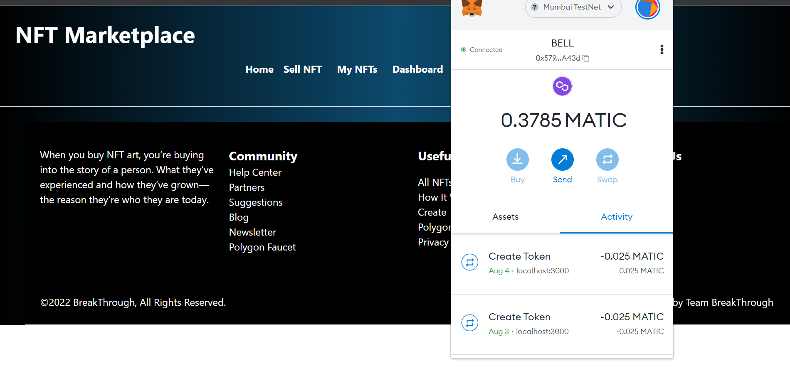
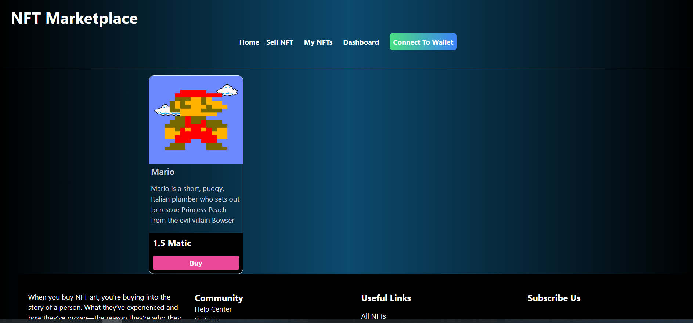

## Full stack A NFT marketplace built with Polygon, Solidity, IPFS, & Next.js

### Running this project


#### Local setup

To run this project locally, follow these steps.

1. Clone the project locally, change into the directory, and install the dependencies:

```sh
git clone https://github.com/mazhar11-cou/DigitalStack-A-NFT-Marketplace.git

cd DigitalStack-A-NFT-Marketplace

# install using NPM or Yarn
npm install

# or

yarn
```

2. Start the local Hardhat node

```sh
npx hardhat node

# or

yarn hardhat node

```

3. With the network running, deploy the contracts to the local network in a separate terminal window

```sh
npx hardhat run scripts/deploy.js --network localhost

# or 

npx hardhat run scripts/deploy.js --network localhost

```

4. Start the app

```
npm run dev

# or

yarn dev
```

### Configuration

To deploy to Polygon test or main networks, update the configurations located in __hardhat.config.js__ to use a private key and, optionally, deploy to a private RPC like Infura.

```javascript
require("@nomiclabs/hardhat-waffle")
require("@nomiclabs/hardhat-etherscan")
require("hardhat-deploy")
require("solidity-coverage")
require("hardhat-gas-reporter")
require("hardhat-contract-sizer")
require("dotenv").config()

/**
 * @type import('hardhat/config').HardhatUserConfig
 */

const MAINNET_RPC_URL =
    process.env.MAINNET_RPC_URL ||
    process.env.ALCHEMY_MAINNET_RPC_URL ||
    "https://eth-mainnet.alchemyapi.io/v2/your-api-key"
const RINKEBY_RPC_URL =
    process.env.RINKEBY_RPC_URL || "https://eth-rinkeby.alchemyapi.io/v2/your-api-key"
const KOVAN_RPC_URL =
    process.env.KOVAN_RPC_URL || "https://eth-kovan.alchemyapi.io/v2/your-api-key"
const MUMBAI_RPC_URL =
    process.env.MUMBAI_RPC_URL || "https://rpc-mumbai.maticvigil.com/"
const PRIVATE_KEY = process.env.PRIVATE_KEY || "0x"
// optional

// Your API key for Etherscan, obtain one at https://etherscan.io/
const ETHERSCAN_API_KEY = process.env.ETHERSCAN_API_KEY || "Your etherscan API key"
const POLYGONSCAN_API_KEY = process.env.POLYGONSCAN_API_KEY || "Your polygonscan API key"
const REPORT_GAS = process.env.REPORT_GAS || false

module.exports = {
    defaultNetwork: "hardhat",
    networks: {
        hardhat: {
            // // If you want to do some forking, uncomment this
            // forking: {
            //   url: MAINNET_RPC_URL
            // }
            chainId: 31337,
        },
        localhost: {
            chainId: 31337,
        },
        kovan: {
            url: KOVAN_RPC_URL,
            accounts: PRIVATE_KEY !== undefined ? [PRIVATE_KEY] : [],
            //accounts: {
            //     mnemonic: MNEMONIC,
            // },
            saveDeployments: true,
            chainId: 42,
        },
        rinkeby: {
            url: RINKEBY_RPC_URL,
            accounts: PRIVATE_KEY !== undefined ? [PRIVATE_KEY] : [],
            //   accounts: {
            //     mnemonic: MNEMONIC,
            //   },
            saveDeployments: true,
            chainId: 4,
        },
        mainnet: {
            url: MAINNET_RPC_URL,
            accounts: PRIVATE_KEY !== undefined ? [PRIVATE_KEY] : [],
            //   accounts: {
            //     mnemonic: MNEMONIC,
            //   },
            saveDeployments: true,
            chainId: 1,
        },
        mumbai : {
          url: MUMBAI_RPC_URL,
          accounts: PRIVATE_KEY !== undefined ? [PRIVATE_KEY] : [],
          saveDeployments: true,
          chainId: 80001,

        }
    },

  solidity: {
    version: "0.8.4",
    settings: {
      optimizer: {
        enabled: true,
        runs: 200
      }
    }
  }
};

```

If using Infura, update __.infuraid__ with your [Infura](https://infura.io/) project ID.

The project output like that:




After go to the Sell page we may sell our NFT by providing information. 


Great! Your NFT is minted plus added your Marketplace. Now anyone can buy this. 

